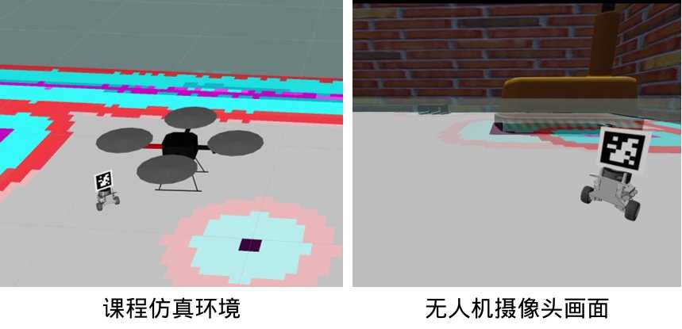

2024-06-16：无人机位姿话题重映射为 /pose。

# 智能无人系统综合设计仿真环境



西北工业大学[智能无人系统综合设计](https://github.com/cavayangtao/npurobocourse)课程仿真环境

仿真建立在开源项目[hector_quadrotor](https://github.com/RAFALAMAO/hector-quadrotor-noetic)和[tianbot_mini](https://github.com/tianbot/tianbot_mini)基础上。

测试环境：Ubuntu 20.04/ROS Noetic。

## Usage

编译：

```
catkin_make_isolated
```

启动gazebo仿真环境，一个无人机，一个小车：

```
roslaunch hector_quadrotor_demo outdoor_flight_gazebo.launch
```

小车gmapping建图：

```
roslaunch tianbot_mini slam.launch
```

小车amcl定位导航：

```
roslaunch tianbot_mini amcl.launch
```

小车跟随无人机（无避障）：

```
rosrun hector_quadrotor_demo turtle_tf2_listener.py
```

小车跟随无人机（避障）：

```
roslaunch tianbot_mini amcl.launch
rosrun rmtt_tracker pub_goal.py
```

无人机跟踪小车二维码：

```
##启动无人机键盘遥控节点，使相机对准二维码
rosrun teleop_twist_keyboard teleop_twist_keyboard.py
##打开新终端
roslaunch rmtt_apriltag detection.launch
##打开新终端
roslaunch rmtt_tracker rmtt_tag_tracker.launch
```

## Competition

如果无人机摄像头需要改成垂直向下，修改npu_simulator/hector-quadrotor-noetic/hector_quadrotor/hector_quadrotor_description/urdf/quadrotor_hokuyo_utm30lx.urdf.xacro第22行，将摄像头角度改成：
```
<origin xyz="0.05 -0.0 -0.25" rpy="0 ${M_PI*90/180} 0"/>
```

## 引用

    @ARTICLE{yt23jygc,
        author={杨韬, 常晓飞, 张通, 付斌, 符文星},
        journal={教育观察}, 
        title={面向“人工智能+无人系统”的课程建设——以智能无人系统综合设计课程为例}, 
        year={2023},
        volume={12},
        number={22},
        pages={56-60}}

## Copyright

Please check [here](LICENSE.txt).
